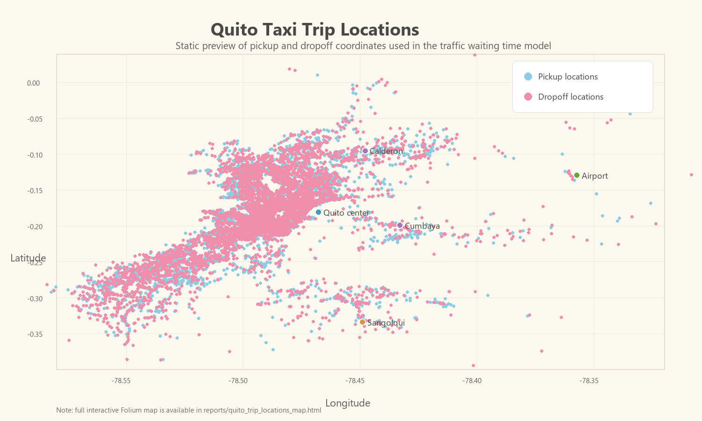

# Traffic Waiting Time Prediction in Quito

## Project Overview

This project predicts how long taxi passengers are likely to remain completely stopped in traffic during a trip in Quito, Ecuador.

The target variable is `wait_sec`, measured in seconds. It represents the time a taxi was stationary during a trip.

This is a regression and transportation analytics project focused on building a realistic predictive modeling workflow: data validation, domain-based cleaning, exploratory analysis, feature engineering, model comparison, hyperparameter tuning, external holdout evaluation, and model interpretation.

## Business Context

A taxi app can improve passenger experience by giving users a more realistic estimate of traffic-related waiting time. This information can help passengers prepare for longer journeys and can also help the company better understand trips affected by congestion.

From a business perspective, traffic waiting time matters because trips with long stationary delays may reduce customer satisfaction and may be less efficient operationally.

## Objective

Build a regression model that predicts `wait_sec` using trip information such as:

- pickup time
- pickup and dropoff coordinates
- estimated trip duration without traffic
- trip distance
- taxi vendor
- engineered temporal, geographic, and route-based features

The primary evaluation metric is **Mean Absolute Error (MAE)** because it is measured in seconds and is easy to communicate to non-technical stakeholders.

## Skills Demonstrated

This project demonstrates:

- regression modeling for a real-world transportation problem
- data cleaning using geographic and business rules
- outlier treatment based on implied estimated speed
- exploratory data analysis with professional visual storytelling
- datetime feature engineering
- geospatial analysis using latitude and longitude
- interactive mapping with Folium
- scikit-learn pipelines
- model comparison across multiple regressors
- hyperparameter tuning with `RandomizedSearchCV`
- external holdout evaluation
- permutation importance for model interpretation
- generation of reusable model and prediction artifacts

## Data and Domain Rules

The data contains taxi trip records from Quito. Each row represents one trip.

Important domain information from the project brief:

- relevant latitude range: `[-0.4, 0.05]`
- relevant longitude range: `[-78.6, -78.3]`
- rainy season in Ecuador: October to May
- dry season: June to September
- approximate speed context: 50 km/h in the city and 70 km/h toward the airport

These rules were used to guide data cleaning, outlier inspection, and feature engineering.

## Methodology

The project follows a complete machine learning workflow:

1. Load and validate the data.
2. Check missing values, duplicates, categorical levels, and numerical ranges.
3. Clean records outside Quito coordinate bounds.
4. Remove invalid estimated-duration values.
5. Inspect and treat unrealistic implied-speed outliers.
6. Explore target, numerical, temporal, vendor, and geographic patterns.
7. Create reusable feature engineering functions.
8. Build a scikit-learn preprocessing and modeling pipeline.
9. Compare baseline regression models.
10. Tune the best model family using cross-validation.
11. Evaluate the final model on validation and external holdout data.
12. Interpret the model using permutation importance.
13. Save the final model and generate test predictions.

## Models Compared

The baseline comparison included:

- Ridge Regression
- Random Forest Regressor
- Extra Trees Regressor
- Histogram Gradient Boosting Regressor

Histogram Gradient Boosting performed best as a baseline model and was selected for hyperparameter tuning.

## Final Model

The final selected model is a tuned `HistGradientBoostingRegressor` inside a scikit-learn pipeline.

| Dataset | MAE | RMSE | R2 |
|---|---:|---:|---:|
| Validation set | 147.20 sec | 227.96 sec | 0.377 |
| External holdout set | 145.55 sec | 216.76 sec | 0.389 |

The model predicts typical traffic waiting time with an average error of about **2.4 minutes**.

## Key Findings

- Estimated trip duration is the strongest predictor of traffic waiting time.
- Pickup and dropoff coordinates are important, showing that geography matters.
- Estimated speed adds useful information by combining distance and estimated duration.
- Day of week and pickup hour contribute to prediction, supporting the importance of temporal traffic patterns.
- The model performs consistently on validation and external holdout data.
- Extreme traffic delays remain difficult to predict, so predictions should be treated as estimates rather than exact values.

## Key Predictors

Permutation importance showed the strongest predictors were:

1. estimated trip duration
2. pickup longitude
3. estimated speed
4. dropoff longitude
5. pickup day of week
6. pickup latitude
7. dropoff latitude
8. longitude displacement
9. pickup hour
10. distance

These results are consistent with the exploratory analysis: traffic waiting time is influenced by trip scale, geography, route characteristics, and temporal context.

## Project Outputs

The repository includes:

- final analysis notebook
- cleaned modeling workflow inside the notebook
- saved trained model pipeline
- prediction file for the unlabeled test features
- interactive Quito trip-location map
- project requirements file

## Map Preview

GitHub does not render interactive Folium maps directly inside notebooks, so this repository includes a static preview of the trip locations and a separate interactive HTML map.



The full interactive map is available in `reports/quito_trip_locations_map.html`.

## Repository Structure

```text
traffic-wait-time-prediction-quito/
  data/
    data_train.csv
    features_test.csv
    features_aim.csv
    target_aim.csv
    Traffic Volume - Description.pdf
  notebooks/
    01_traffic_wait_time_prediction_quito.ipynb
  models/
    traffic_wait_time_model.pkl
  images/
    quito_trip_locations_map.png
  reports/
    quito_trip_locations_map.html
    traffic_wait_time_predictions.csv
    figures/
  README.md
  requirements.txt
```

## Main Notebook

The full analysis is available here:

[notebooks/01_traffic_wait_time_prediction_quito.ipynb](notebooks/01_traffic_wait_time_prediction_quito.ipynb)

## How to Run

Install the required Python packages:

```bash
pip install -r requirements.txt
```

Then open and run the notebook:

```text
notebooks/01_traffic_wait_time_prediction_quito.ipynb
```

The notebook saves:

- `models/traffic_wait_time_model.pkl`
- `reports/traffic_wait_time_predictions.csv`
- `reports/quito_trip_locations_map.html`

## Map Attribution

**Map attribution:** Interactive maps were created with Folium using CARTO basemap tiles and OpenStreetMap data. Map attribution is displayed directly on the interactive map.

## Possible Next Improvements

- Add external traffic, weather, or event data.
- Engineer distance to airport or distance to city center.
- Use map-based clustering of pickup and dropoff areas.
- Test time-based validation instead of random validation.
- Build prediction intervals to communicate uncertainty.
- Deploy the model in a small Streamlit demo.
